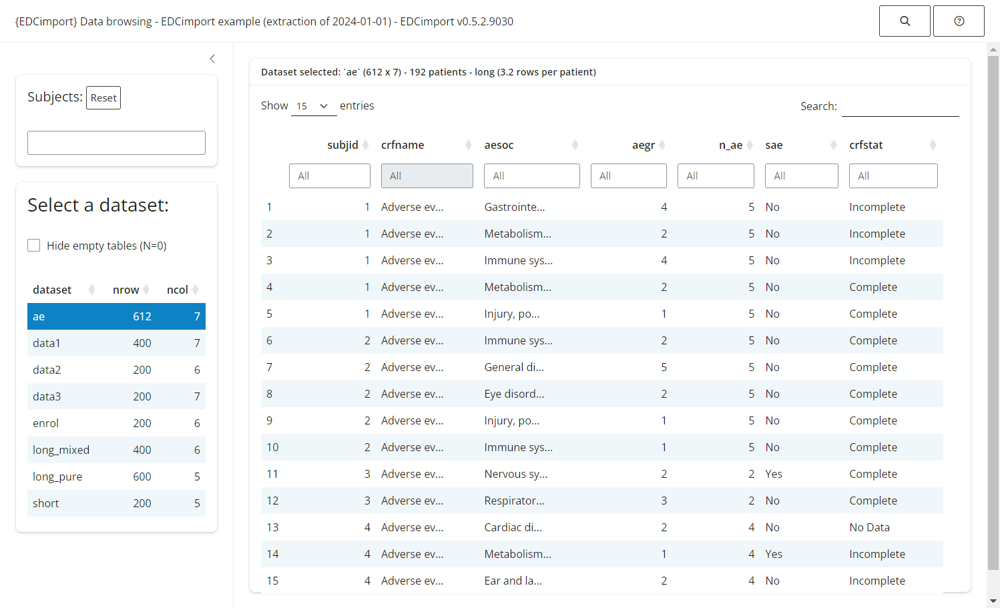

# 1 - Read your database

## Read your database

If you are reading this vignette, chances are that you have requested an
export from an EDC software that provided you with a directory filled
with files of datasets.

Wouldn’t it be so tedious if you had to load all those files one by one?
Lucky you, EDCimport knows a better way!

Depending on the type of files in your export directory, you should use:

- [`read_all_sas()`](https://danchaltiel.github.io/EDCimport/reference/read_all_sas.md),
  to read `.sas7bdat` files

- [`read_all_xpt()`](https://danchaltiel.github.io/EDCimport/reference/read_all_xpt.md),
  to read `.xpt` files

- [`read_all_csv()`](https://danchaltiel.github.io/EDCimport/reference/read_all_csv.md),
  to read `.csv` files

- [`read_trialmaster()`](https://danchaltiel.github.io/EDCimport/reference/read_trialmaster.md)
  to read a [TrialMaster](https://www.anjusoftware.com/trial-master/)
  zip archive.

Formats are imported through a metadata file, `format_file`, that can be
either:

- a `procformat.sas` file, containing the whole PROC FORMAT

- a catalog file (`.sas7bcat`)

- or a data file (`.csv` or `.sas7bdat`) containing 3 columns: the SAS
  format name (repeated), each level, and its associated label. Use
  `options(edc_var_format_name="xxx", edc_var_level="xxx", edc_var_label="xxx")`
  to specify the names of the columns.

You can then load your datasets into the global environment with
[`load_database()`](https://danchaltiel.github.io/EDCimport/reference/load_database.md).

``` r
library(EDCimport)
db = read_all_sas("path/to/my/files/folder", format_file="procformat.sas")
print(db)
load_database(db) #this also removes `db` to save some RAM
mean(dataset1$column5)
```

## Explore your database

Knowing a CRF by hand is not always an easy task, so EDCimport provide a
few useful tools:

- [`edc_lookup()`](https://danchaltiel.github.io/EDCimport/reference/edc_lookup.md),
  to remember what are the available datasets.

- [`edc_find_column()`](https://danchaltiel.github.io/EDCimport/reference/edc_find_value.md)
  and
  [`edc_find_value()`](https://danchaltiel.github.io/EDCimport/reference/edc_find_value.md),
  to search the database for a column/label or for an actual value.

``` r
db = edc_example()
load_database(db)
edc_lookup()
#> ── Lookup table - EDCimport example (extraction of 2024-01-01) - EDCimport v0.7.
#>   dataset     nrow  ncol  n_id rows_per_id crfname                 
#>   <chr>      <dbl> <dbl> <int>       <dbl> <chr>                   
#> 1 long_pure    150     4    50         3   long data               
#> 2 data1        100     7    50         2   data1                   
#> 3 long_mixed   100     6    50         2   both short and long data
#> 4 data2         50     6    50         1   data2                   
#> 5 data3         50     7    50         1   data3                   
#> 6 enrol         50     6    50         1   enrol                   
#> 7 short         50     5    50         1   short data              
#> 8 ae           175     7    48         3.6 Adverse events
edc_find_column("date")
#> # A tibble: 11 × 5
#>    dataset crfname names      labels            prop_na
#>    <chr>   <chr>   <chr>      <chr>               <dbl>
#>  1 data1   data1   date1      Date at visit 1         0
#>  2 data1   data1   date2      Date at visit 2         0
#>  3 data1   data1   date3      Date at visit 3         0
#>  4 data2   data2   date4      Date at visit 4         0
#>  5 data2   data2   date5      Date at visit 5         0
#>  6 data2   data2   date6      Date at visit 6         0
#>  7 data3   data3   date7      Date at visit 7         0
#>  8 data3   data3   date8      Date at visit 8         0
#>  9 data3   data3   date9      Date at visit 9         0
#> 10 data3   data3   date10     Date at visit 10        0
#> 11 enrol   enrol   enrol_date Date of enrolment       0
edc_find_value("immune")
#> # A tibble: 7 × 5
#>   subjid dataset column column_label value                  
#>   <chr>  <chr>   <chr>  <chr>        <chr>                  
#> 1 9      ae      aesoc  AE SOC       Immune system disorders
#> 2 24     ae      aesoc  AE SOC       Immune system disorders
#> 3 26     ae      aesoc  AE SOC       Immune system disorders
#> 4 31     ae      aesoc  AE SOC       Immune system disorders
#> 5 46     ae      aesoc  AE SOC       Immune system disorders
#> 6 46     ae      aesoc  AE SOC       Immune system disorders
#> 7 49     ae      aesoc  AE SOC       Immune system disorders
```

## Shiny browser

The simplest way to explore your database is by running
[`edc_viewer()`](https://danchaltiel.github.io/EDCimport/reference/edc_viewer.md),
which launches a local Shiny application:

``` r
db = edc_example()
load_database(db)
edc_viewer()
```


