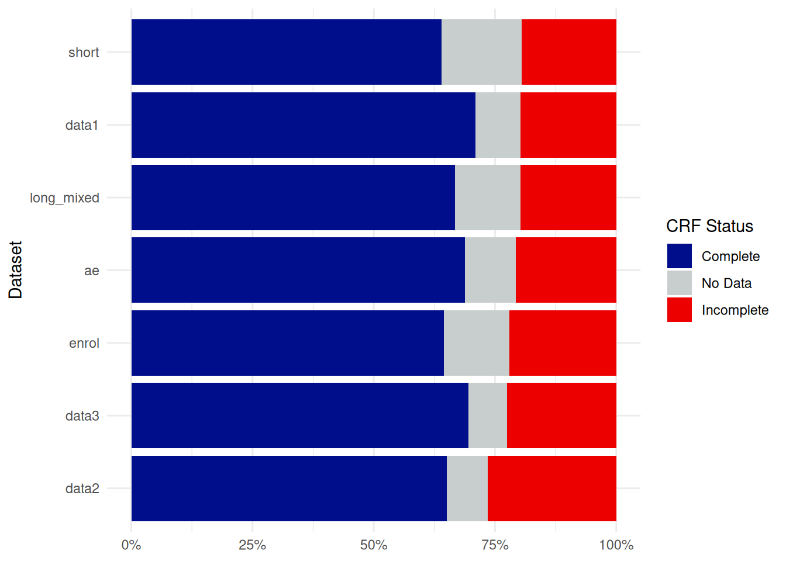
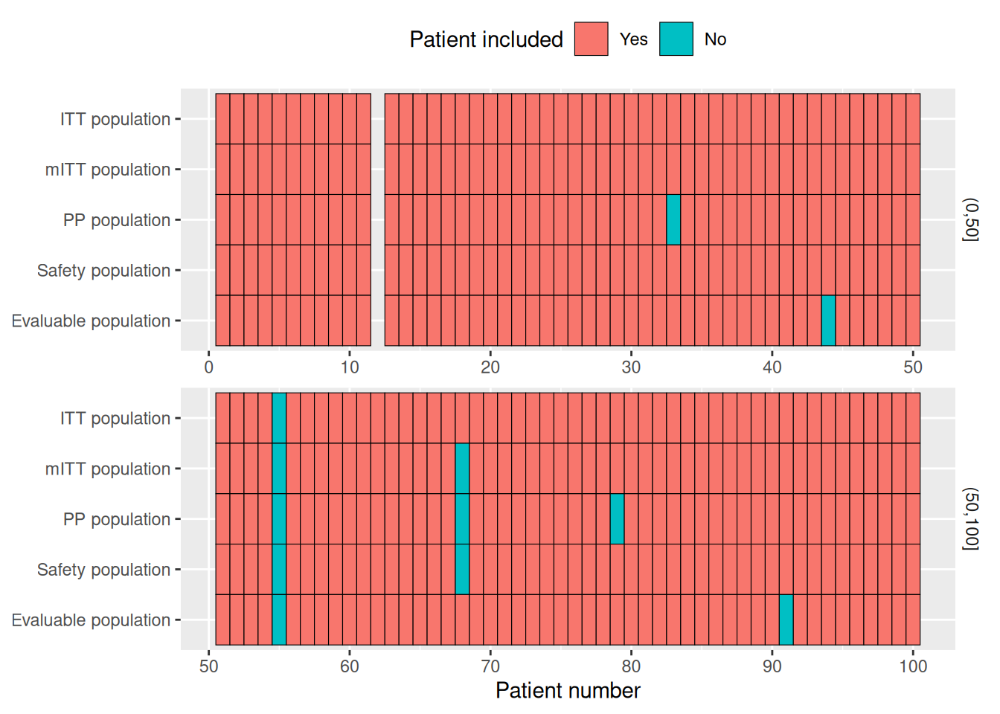

# 4 - Database Visualizing

## Introduction

You imported your database, but now you might want to visualize some
part of it.

There are a lot of ways to do so, so EDCimport provides functions for a
few concepts.

As in previous vignettes, we will be using
[`edc_example()`](https://danchaltiel.github.io/EDCimport/reference/edc_example.md),
but in the real world you should use EDC reading functions. See
[`vignette("reading")`](https://danchaltiel.github.io/EDCimport/articles/reading.md)
to see how.

``` r
library(EDCimport) 
library(dplyr) 
db = edc_example(N=200) %>%
  edc_unify_subjid() %>%
  edc_clean_names() 
db 
#> ── EDCimport database ──────────────────────────────────────────────────────────
load_database(db)
```

## Swimmer plot

Each patient experiences a series of events during their visits,
recorded in Date/Datetime columns across your datasets.

A simple and effective method to identify errors and inconsistencies is
to create a `swimmerplot` of these columns. This visualization helps to
quickly spot incorrect sequences, data entry errors, or unexpected time
gaps.

For example, you can check that no experimental treatment was
administered before enrollment and that the latest recorded date appears
in the follow-up dataset.

``` r
edc_swimmerplot(origin="enrol$enrol_date")
```


A convenient way to perform these checks is by using the interactive
plot with `plotly=TRUE`. Although it cannot be displayed within a
vignette, the output can be saved as a standalone HTML file for easy
sharing.

``` r
sp = edc_swimmerplot(plotly=TRUE)
sp
save_plotly(sp, "swimmerplot.html")
```

## CRF completion plot

Using
[`edc_crf_plot()`](https://danchaltiel.github.io/EDCimport/reference/edc_crf_plot.md),
you can generate a barplot showing the distribution of CRF status
(Complete, Incomplete, …) for each dataset of the database.

``` r
edc_crf_plot()
```



## Patient gridplot

Using
[`edc_patient_gridplot()`](https://danchaltiel.github.io/EDCimport/reference/edc_patient_gridplot.md),
you can visualize which patients are included in each dataset and
identify any problematic missing records.

``` r
edc_patient_gridplot()
#> Ignoring unknown labels:
#> • colour : "Included"
```


## Population plot

With
[`edc_population_plot()`](https://danchaltiel.github.io/EDCimport/reference/edc_population_plot.md),
you can visualize the different analysis populations. Here, we use
[`setdiff()`](https://generics.r-lib.org/reference/setops.html) to
exclude patients from the various populations, but in real-world data
you should probably use
[`dplyr::filter()`](https://dplyr.tidyverse.org/reference/filter.html).

``` r
# Total population: all screened patients
pop_total <- c(1:100) %>% setdiff(12) #Software error, SUBJID attributed twice

# ITT (Intent-to-Treat): All randomized patients (excluding screening failures only)
pop_itt <- pop_total %>% setdiff(55)

# mITT (Modified ITT): All treated patients
pop_m_itt <- pop_itt %>% setdiff(68) #Patient 68 randomized but never received treatment

# PP (Per-Protocol): Patients who completed treatment without major protocol deviations
pop_pp <- pop_m_itt %>% setdiff(c(33, 79)) #Major deviations

# Safety: All patients who received at least one dose of treatment
pop_safety <- pop_itt %>% setdiff(68)  #Same as mITT

# Evaluable: Patients who completed required assessments for primary endpoint
pop_evaluable <- pop_itt %>% setdiff(c(44, 91))  #No primary endpoint assessment

l = list(
  "Total population"=pop_total,
  "ITT population"=pop_itt,
  "mITT population"=pop_m_itt,
  "PP population"=pop_pp,
  "Safety population"=pop_safety,
  "Evaluable population"=pop_evaluable
)
edc_population_plot(l[-1], ref=pop_total)
```


